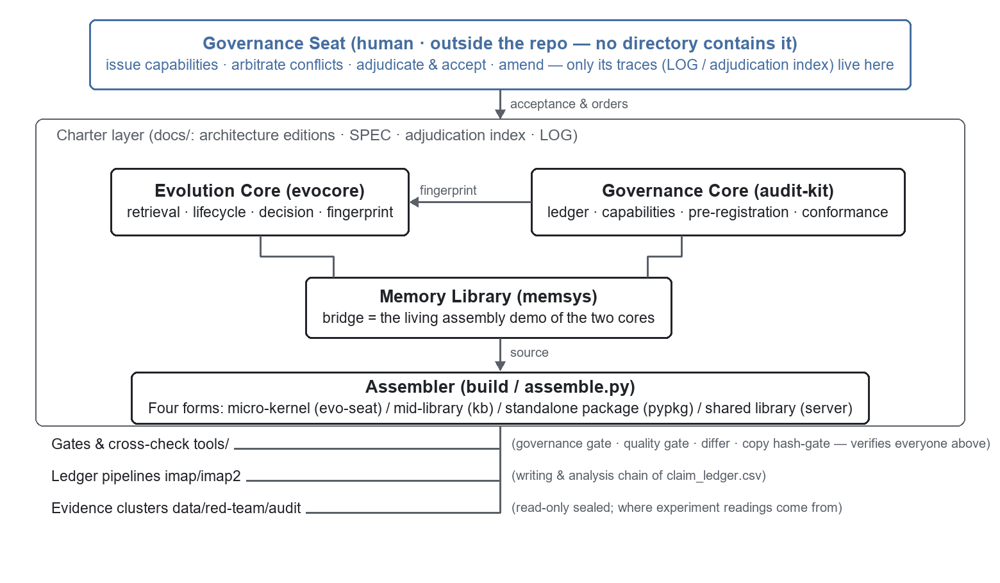

# AI Trust Governance Framework · Module Release

[中文](README.md) ｜ [English](README.en.md)

> **This repository is the public module release face** of the framework: Governance Core
> (audit-kit) + Evolution Core (evocore) + Memory Library (memsys) + Micro-kernel (evo-seat) +
> Assembler (build) + Gates & Cross-check (tools) + Release Face (skill).
> Pure Python standard library, **zero third-party dependencies**; every module ships its own
> unittest suite. License: **MIT** (see `LICENSE`). Module relationships are taken from a
> measured survey dated 2026-09-25
> (320 AST import edges + Tarjan cycle detection).
> Further reading: `ARCHITECTURE-定版v1.0-20260923.md` (concept charter, in Chinese) →
> `架构图-20260923.md` (full architecture chart, in Chinese).

## 0 · The skeleton in one picture



<details><summary>Text version (aligned in monospace terminals)</summary>

```
                    ┌───────────── 治理位（人 · 库外，任何目录里都没有它）─────────────┐
                    │   签凭证 · 仲裁冲突 · 验收裁定 · 修宪 —— 仓里只有它的笔迹(LOG/裁定索引) │
                    └──────────────────────────┬──────────────────────────┘
                                               │ 验收与令
   ┌─────────────── 规范层（docs/：定版·SPEC·裁定索引·LOG）───────────────┐
   │                                                                     │
   │            ┌──── 演化核 evocore ────┐      ┌──── 治理核 audit-kit ────┐ │
   │            │ 检索·生命周期·决策·指纹 │◄─────│ 账本·凭证·预注册·符合性  │ │
   │            └───────────┬───────────┘ 指纹  └───────────┬──────────────┘ │
   │                        │      ┌──── 记忆库 memsys ────┘                │
   │                        └──────│ bridge = 双核的活体装配示例             │
   │                               └────────────┬───────────────────────────┘
   │                                            │ 源码
   │                     ┌──── 装配器 build（assemble.py）────┘
   │                     │ 四种产物：微内核(evo-seat) / 中库(kb) / 独立包(pypkg) / 共库(server)
   │                     └────────────┬─────────────────────────────────────
   └──────────────────────────────────┼─────────────────────────────────────
        门与对账 tools/ ──────────────┘（治理门·质量门·对拍器·副本闸——检验上面所有人）
        账目管线 imap/imap2 ──────────┐（claim_ledger.csv 的写入与分析链）
        物证簇 data/red-team/audit ───┘（只读封存，实验读数的出处）
```

</details>

## 1 · The two cores (the foundation; they never import each other — by design)

**Evolution Core (`evocore/`, 14 files)**: governs "**how memory stays alive**". The content
fingerprint (`content_hash` in `entry.py`) is the single hash source of the whole system
(64 hex chars, volatile fields like id/state excluded; the rule is pinned by
`build/tests/test_content_hash_divergence.py`); `lifecycle.py` is the state machine
(ACTIVE→ATTIC→TOMBSTONE, migration only, never destruction); retrieval scoring, decision
rules, and all parameters are externalized (version-negotiable).

**Governance Core (`audit-kit/`, 14 files)**: governs "**who may do what, and everything
leaves a trace**". The append-only chain ledger (`ledger/ledger.py`: per-write transactions,
triggers that physically forbid UPDATE/DELETE, chain verified on open); capability tokens
(`Capability` in `core/gov_types.py`: grant∩deny constructed-impossible); pre-registered
criteria (`core/prereg.py`); the self-bootstrapper (`boot_self.py` records its own commits
in its own ledger).

**Relationship**: the Evolution Core does not know the Governance Core exists, and the
Governance Core never imports the Evolution Core. Their only junction is the fingerprint
function — memory-content integrity is verifiable from the governance side, while the two
code bases stay fully decoupled ("united execution, evidence from separate roots").

## 2 · Memory Library (memsys) — the currently attached host (7 files)

The bridge (`bridge.py`) imports capability + ledger from the Governance Core and the
content fingerprint from the Evolution Core, gluing the two cores into a working memory
library — proof that "the two cores assemble" is not a slide. Touch either core and the
bridge plus its 17 tests notice immediately. The type registry (`kinds.yml`) is
cross-checked against the bridge's built-in table by `tools/tools_crosscheck.py`.

### The essence of a host: replaceable — and governable because of it

A **host** is the governed executor: the layer that actually holds content and performs
writes. The Memory Library (memsys) is not the system itself — it is merely **the currently
attached host instance**, the first assembly demo.

The two cores know **nothing** about the host; they connect through four contact points:
① present a **capability** before writing (issued by the Governance Core);
② pass the content through the **fingerprint** (computed by the Evolution Core);
③ append the event to the **ledger** (Governance Core);
④ expose state for **cross-checking** (Gates & Cross-check).

⇒ **Generality**: any system satisfying these four contact points — an LLM wiki, an artifact
library, a database, workflow auditing, any agent's knowledge base — can be a host.
⇒ **Replaceability**: swap the host and the two cores change nothing, the gates change
nothing (at most one adapter), and every governance enforcement keeps working. The
governance seat lives outside the library and is not parasitic on the host — that is why
swapping hosts is so cheap.

## 3 · Assembler (build — one codebase, four package forms, 34 files)

`assemble.py` mechanically produces four forms from the same two-core source: micro-kernel
(fused single file) / mid-library (self-contained package) / standalone package (pip) /
shared library (server; `l2server/server.py` is the MCP service form). `tests/` (131 tests)
is the heaviest judge of the whole system (measured: when an Evolution-Core property broke,
build's gate turned red first); `manifests/` records artifact hashes for release
reconciliation.

**Relationship red line**: the assembler mirrors source code by path and string templates —
**changing a core file requires syncing the assembler**, otherwise the release tree drifts
silently.

## 4 · Gates & Cross-check (tools — the immune system)

Not in the production data flow; exists to verify everyone else: the governance gate
(`hooks/pre-commit`: ledger append-only / log numbering / copy consistency / criterion
surface — four checks); the invariant scanner (`invariant_scanner.py`); the quality gate
(`code_quality_gate.py`); the behavior differ (`S1_verify_behavior.py`); the two-library
cross-checker (`tools_crosscheck.py`); the vendored-copy hash gate
(`check_vendored_copies.py`); the registry (`README-工具面状态.md`, in Chinese). A one-way
consumer of the Evolution Core (imports it only to verify).

## 5 · Release Face (skill)

Wraps the system into something shippable: `SKILL.md` + install scripts + self-contained
copies (gated by `tools/check_vendored_copies.py` — vendored copies are not a sin; **drift**
is, so the gate enforces consistency, not deduplication).

## 6 · One real write, end to end (tying it together)

A host agent calls the memory library's ledger to write one memory → it first asks the
Governance Core for a capability (no capability, instant refusal) → the Evolution Core
computes the content fingerprint (dedup + integrity anchor) → the Governance Core's ledger
appends the event into the chain (with prev-hash linkage) → once written, the cross-checker
can prove both libraries share one chain, and the governance gate guarantees nobody can
delete it.

## 7 · One-sentence summary

**The Evolution Core keeps memory alive; the Governance Core keeps the ledger of behavior;
the Memory Library is just the current host — hosts change, governance does not; the
Assembler proves they assemble into four forms; Gates & Cross-check trust nothing.**

## Tests

Every module ships its own `tests/` (unittest, pure standard library):
`py -X utf8 -m unittest discover -s tests -q` (run inside the module directory).

| Suite | Runs standalone |
|---|---|
| evocore 78 / audit-kit 54 / memsys 17 | ✓ all green — the three cores are fully self-contained |
| tools 11 | 1 short: the copy-gate's "real-repo assertion" needs the full workspace layout |
| build 131 | live-gate suite — needs the full governance workspace; all green there; presented here as source |

In short: **the three cores are self-contained**; build and tools are live gates designed to
run inside the full workspace.
