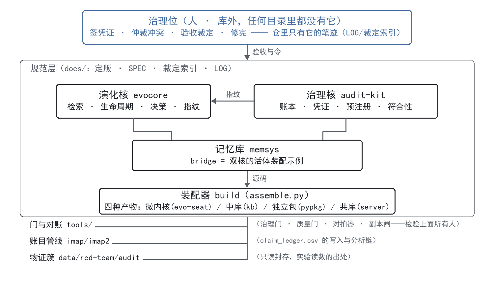

# AI 可信治理框架 · 模块发布

[中文](README.md) ｜ [English](README.en.md)

> **本仓是模块发布面（公开）**：治理核（audit-kit）＋ 演化核（evocore）＋ 记忆库（memsys）＋
> 微内核（evo-seat）＋ 装配器（build）＋ 门与对账面（tools）＋ 发布面（skill）。
> 纯 Python 标准库，**零第三方依赖**；各模块自带 unittest 测试套件。
> 模块间关系取自 2026-09-25 的实测测绘（AST 依赖边 320 条 + Tarjan 环检测）。
> 深入阅读：`ARCHITECTURE-定版v1.0-20260923.md`（概念总纲·冻结清单）→ `架构图-20260923.md`（完整架构图：两轴×三产品×一码四包）。

## 〇 · 一张图先立骨架



<details><summary>文字版（等宽终端里对齐）</summary>

```
                    ┌───────────── 治理位（人 · 库外，任何目录里都没有它）─────────────┐
                    │   签凭证 · 仲裁冲突 · 验收裁定 · 修宪 —— 仓里只有它的笔迹(LOG/裁定索引) │
                    └──────────────────────────┬──────────────────────────┘
                                               │ 验收与令
   ┌─────────────── 规范层（docs/：定版·SPEC·裁定索引·LOG）───────────────┐
   │                                                                     │
   │            ┌──── 演化核 evocore ────┐      ┌──── 治理核 audit-kit ────┐ │
   │            │ 检索·生命周期·决策·指纹 │◄─────│ 账本·凭证·预注册·符合性  │ │
   │            └───────────┬───────────┘ 指纹  └───────────┬──────────────┘ │
   │                        │      ┌──── 记忆库 memsys ────┘                │
   │                        └──────│ bridge = 双核的活体装配示例             │
   │                               └────────────┬───────────────────────────┘
   │                                            │ 源码
   │                     ┌──── 装配器 build（assemble.py）────┘
   │                     │ 四种产物：微内核(evo-seat) / 中库(kb) / 独立包(pypkg) / 共库(server)
   │                     └────────────┬─────────────────────────────────────
   └──────────────────────────────────┼─────────────────────────────────────
        门与对账 tools/ ──────────────┘（治理门·质量门·对拍器·副本闸——检验上面所有人）
        账目管线 imap/imap2 ──────────┐（claim_ledger.csv 的写入与分析链）
        物证簇 data/red-team/audit ───┘（只读封存，实验读数的出处）
```

</details>

## 一 · 双核（体系的地基，互不引用——这是设计不是巧合）

**演化核（`evocore/`，14 件）**：管"**记忆怎么活着**"。`entry.py` 的内容指纹（`content_hash`）
是全体系唯一指纹来源（64 位十六进制，排除 id/state 等易变字段；规则钉在
`build/tests/test_content_hash_divergence.py`）；`lifecycle.py` 状态机（活跃→阁下→墓碑，
只迁移不销毁）；检索打分、决策规则、参数全部外置（版本可协商）。

**治理核（`audit-kit/`，14 件）**：管"**谁被允许做什么、做了必留痕**"。链式账本
（`ledger/ledger.py`，即写即事务、触发器物理禁改禁删、开库即验链）；能力令牌
（`core/gov_types.py` 的 `Capability`，准许∩禁止构造即拒）；预注册判据（`core/prereg.py`）；
自举件（`boot_self.py`，用自己的账本记自己的提交）。

**关系**：演化核不知道治理核存在，治理核不引用演化核。唯一交点是那个指纹函数——
记忆内容的完整性由治理侧可验证，但两侧代码零耦合（"执行并集、证据不同根"）。

## 二 · 记忆库（memsys，双核的活体装配示例，7 件）

桥接件（`bridge.py`）同时引用治理核的凭证与账本、演化核的内容指纹，把两核粘成一个
可用的记忆库——证明"双核可装配"不是图纸。改任一核，桥接件和它的 17 个测试立刻知道。
类型注册表（`kinds.yml`）与桥接件内置表的对拍由 `tools/tools_crosscheck.py` 执行。

## 三 · 装配器（build，一码四包，34 件）

`assemble.py` 从同一份双核源码机械产出四种形态：微内核（单文件融合）/ 中库（自足包）/
独立包（pip）/ 共库（服务件，`l2server/server.py` 为 MCP 服务形态）。`tests/` 131 测是
全体系最重的裁判（实测：演化核的性质出事，是 build 的门先红）；`manifests/` 登记产物
哈希供发布对账。

**关系红线**：装配器按路径与模板镜像源码——**改双核文件必须同步装配器**，否则发布树
静默漂移。

## 四 · 门与对账面（tools，体系的免疫系统）

不在生产数据流里，专门检验别人：治理门（`hooks/pre-commit`：账本只追加 / 日志撞号 /
副本一致性 / 判据面四查）；判据扫描器（`invariant_scanner.py`）；质量门
（`code_quality_gate.py`）；行为对拍器（`S1_verify_behavior.py`）；双包对拍器
（`tools_crosscheck.py`）；副本族闸（`check_vendored_copies.py`）；登记表
（`README-工具面状态.md`）。与演化核的关系是单向消费者（验证时引用它）。

## 五 · 发布面（skill）

把体系装进"能发给别人"的壳：`SKILL.md` + 安装脚本 + 自足副本（由副本族闸
`tools/check_vendored_copies.py` 上闸——自带副本不是病，**漂移**才是，闸的是一致性
不是重复）。

## 六 · 一次真实写入的数据流（把上面串起来）

宿主智能体调记忆库的记账器写一条记忆 → 先向治理核要凭证（无凭证即拒）→ 演化核算内容
指纹（去重与完整性锚）→ 治理核账本把事件追加进链（含前哈希衔接）→ 写毕，双包对拍器
可对拍双库同链，治理门保证没人能删账。

## 七 · 一句话收束

**演化核管记忆的生命，治理核管行为的账，记忆库证明两者能装在一起，装配器证明能装成
四种形态，门与对账面负责怀疑一切。**

## 测试

各模块自带 `tests/`（unittest，纯标准库即可跑）：
`py -X utf8 -m unittest discover -s tests -q`（在对应模块目录下执行）。

| 套件 | 独立运行 |
|---|---|
| 演化核 78 测 / 治理核 54 测 / 记忆库 17 测 | ✓ 全绿——三核完全自足 |
| 门与对账面 11 测 | 差 1：副本族校验器的"真仓常态断言"依赖完整工作区的副本族布局 |
| 装配器 131 测 | 活体门套件——依赖完整治理工作区，在全量仓里全绿；本仓按源码呈现 |

即：**三核自足**；装配器与门面是"检验别人"的活体门，本就设计为在完整工作区里运行。
